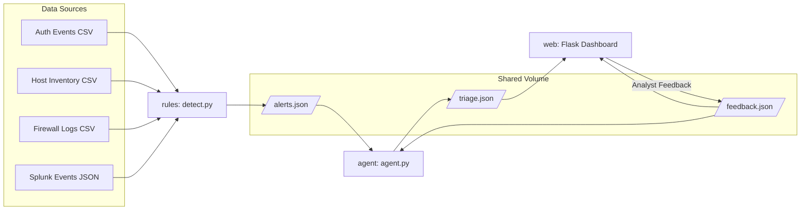

# AI-Assisted Energy SOC Demo

## Overview
- Self-contained security operations demo tailored for energy-sector OT/IT environments (SCADA, EMS, historian systems)
- Demonstrates rule-based detections feeding an AI triage agent with human-in-the-loop feedback
- Ships synthetic CSV/JSON telemetry so the full stack runs offline after `docker-compose up`

## Architecture

## Prerequisites
- Docker 24+
- Docker Compose v2
- OpenRouter API key (set via environment variable only)

## Local Setup
1. Clone the repository and move into the project root
2. `cp .env.example .env` and update `OPENROUTER_API_KEY`
3. `docker-compose up --build`
4. Browse to `http://localhost:8080`
5. Review alerts, provide feedback, and observe regenerated AI triage on next cycle

## Data Sources
- `data/auth_events.csv`: synthetic login activity with geo coordinates for impossible travel
- `data/host_inventory.csv`: OT/IT asset inventory with last patch date metadata
- `data/firewall_logs.csv`: perimeter firewall telemetry exposing unauthorized ports
- `data/splunk_events.json`: condensed Splunk anomalies (brute force, privilege escalation, reverse shell)
- `data/vuln_scan.json`: vulnerability scan excerpts for contextual narrative

## Detection Rules (`rules/detect.py`)
- **Impossible Travel**: Geodesic distance between sequential logins >500 mph triggers alert
- **Patch Drift**: Hosts overdue for patches (>30 days high, >60 days critical)
- **Open Ports**: Allowed traffic to non-whitelisted ports (22, 80, 443, 3389) flagged
- **Splunk Correlation**: Aggregates failed logins, privilege escalations, and unusual processes
- Outputs standards-based alert objects to `shared/alerts.json`

## AI Agent (`agent/agent.py`)
- Uses OpenRouter with `nousresearch/hermes-3-llama-3.1-405b`
- System prompt tailored to energy operations safety and availability
- Derives base risk/confidence from rule severity then adjusts via feedback trends
- Persists enhanced triage with AI summaries, remediation steps, and raw LLM context to `shared/triage.json`

## Feedback Loop
- Flask dashboard surfaces triaged alerts with severity/color coding
- Analysts submit approve/reject with required rationale via AJAX
- Feedback stored in `shared/feedback.json` (also exposes alert type for learning)
- Agent ingests history to nudge future confidence scores and provide context to LLM

## Docker Orchestration
- `docker-compose.yml`: local dev stack (bind mounts, port 8080)
- `docker-compose.prod.yml`: production-ready variant (named volume, restart policy, port 80)
- Named services: `rules`, `agent`, `web`
- All API secrets injected strictly through environment variables

## Web Deployment Guidance
- Provision target platform (Render, Railway, Fly.io, etc.) with Docker support
- Set `OPENROUTER_API_KEY` as a protected environment variable in platform settings
- Mount or bake synthetic data/alerts into container (named volume recommended)
- Expose container port 8080 → platform HTTP endpoint
- Enforce HTTPS and restricted inbound access where possible

## API Endpoints
- `GET /` – Dashboard UI (Bootstrap 5, responsive)
- `GET /api/alerts` – Triaged alerts JSON
- `GET /api/feedback` – Feedback history
- `GET /api/stats` – Aggregated metrics
- `POST /feedback` – Submit `{alert_id, action: approved|rejected, reason}`

## Troubleshooting
- Missing API key → agent exits with `ValueError` (set `OPENROUTER_API_KEY`)
- Empty dashboard → confirm `rules` container can write to `shared/alerts.json`
- Feedback not persisting → ensure shared volume is read/write for agent & web
- Compose rebuild issues → use `docker-compose build --no-cache`

## Security Notes
- `.env` ignored by git; ship `.env.example` for onboarding only
- API keys never logged or embedded in frontend
- Flask backend only exposes sanitized metadata (no secrets)
- Logging uses Python `logging` at INFO level with structured error messages
- Ensure production hosting uses TLS and platform-side secret management

## License
- MIT License (see `LICENSE`)